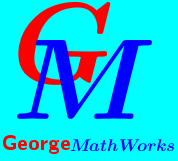

```{r setup, include=FALSE}
knitr::opts_chunk$set(echo = FALSE)
library(rmarkdown)

```

{width=20px}


## About Me

Young,versatile and goal oriented

### Career Objective

To be a vibrant expert in solving real world business problems through Applied Mathematics and Data Science with the ability to assume higher challenging positions.

## Education

Bachelor Of Science (Hons) In Applied Mathematics

## About Maths

The art of logical ideas which when knit with the correct objectives can give a variety of splendid insights which lead to optimistic decisions.

## Ideas

To disseminate the knowledge acquired in pure maths and statistics via face to face and online-classes with the view of reaching out to many who are challenged and some limited by different obstacles.

To provide lessons which involve real world maths applications with the hope of eliminating negativity towards the subject and erasing doubt in some concepts.

## Skills

{width=10px}